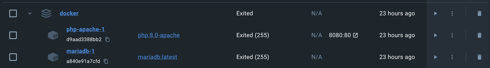

# Lista de supermercado 
## Descrição do projeto 
Um projeto que simula uma lista de supermercado digital. Nele são usadas tecnologias de web e banco de dados. 

## Instalação do projeto: 
### Github
Clonar repositório

```https://github.com/Projetos-Pucc/docker.git```

### Docker-compose 
Na pasta do diretório do projeto, abra o terminal e execute: 
```
docker-compose up 
```

### Docker 
No docker, acessar a porta web 8080:80



